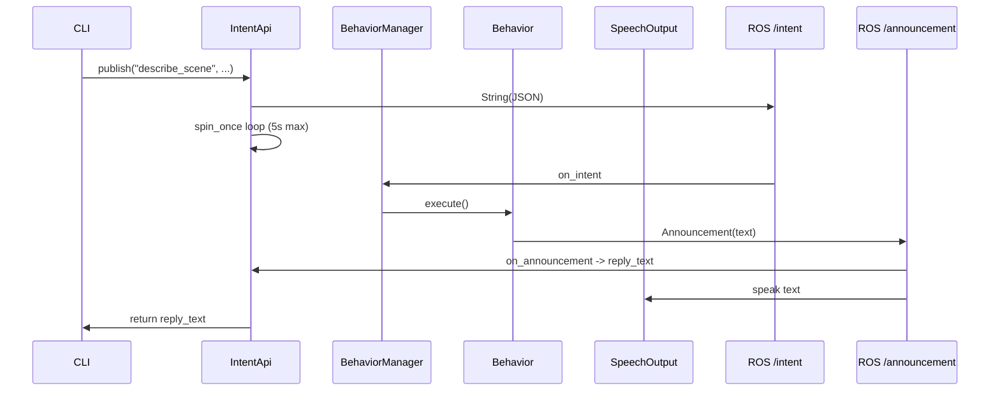

# IntentApi — Publishing Intents and Awaiting Replies

## Purpose

`IntentApi` is the CLI's bridge into the ROS2 graph. It publishes structured intent messages to `/intent` and, for query-type intents, waits synchronously for the reply that arrives on `/announcement`.

## Design: Fire-and-Forget vs. Synchronous Query

Most intents (stop, explore, turn) are fire-and-forget — the CLI doesn't wait for a result. But query intents (`describe_scene`, `list_objects`, `get_status`, `get_help`) produce text the user expects to see printed. A clean boundary separates these two modes:

```python
REPLY_INTENTS = {"describe_scene", "list_objects", "get_status", "get_help"}
REPLY_TIMEOUT_S = 5.0
```

## Node Lifecycle and DDS Warmup

`IntentApi` extends `BaseApi` (which extends `rclpy.Node`). It is created **once at CLI startup** — not lazily per command — so DDS has time to discover the `/announcement` publisher before any command fires. Creating a fresh node per command caused the announcement to arrive before the subscription was registered.

```python
class IntentApi(base.BaseApi):

    def __init__(self, config_manager: cm.ConfigManager = None):
        super().__init__("intent_api", config_manager)
        self.intent_pub = self.create_publisher(String, "/intent", 10)
        self.reply_text: str | None = None
        self.create_subscription(AnnouncementMsg, "/announcement", self.on_announcement, 10)
```

## Announcement Callback

The subscription captures the `text` field from any `Announcement` message. The field is `None` between turns so the spin loop can detect a fresh reply:

```python
    def on_announcement(self, msg) -> None:
        self.reply_text = msg.text
```

## Publishing and Waiting

For non-query intents the method returns `None` immediately. For query intents it spins the node in 100ms increments until a reply arrives or the timeout expires:

```python
    def publish(self, name: str, source: str, slots: dict) -> str | None:
        msg = String()
        msg.data = json.dumps({"name": name, "source": source, "slots": slots})
        self.intent_pub.publish(msg)
        self.log_info(f"Intent published: {msg.data}")

        if name not in REPLY_INTENTS:
            return None

        self.reply_text = None
        deadline = time.monotonic() + REPLY_TIMEOUT_S
        while time.monotonic() < deadline and self.reply_text is None:
            rclpy.spin_once(self, timeout_sec=0.1)
        return self.reply_text
```

The caller (`CommandDispatcher`) uses the returned text as the CLI response message, falling back to `"Intent published: {name}"` if `None`.

## Flow



## Observations

- The 5-second timeout is arbitrary. A tunable constant would be cleaner.
- `reply_text` is public state shared between callback and spin loop. In a multi-threaded executor this would be a race. Safe here because `spin_once` is called from the same thread.
- If two query commands are issued before the first reply arrives, `reply_text` from the first could be consumed by the second's wait loop. Not a practical concern in a REPL but worth noting.
