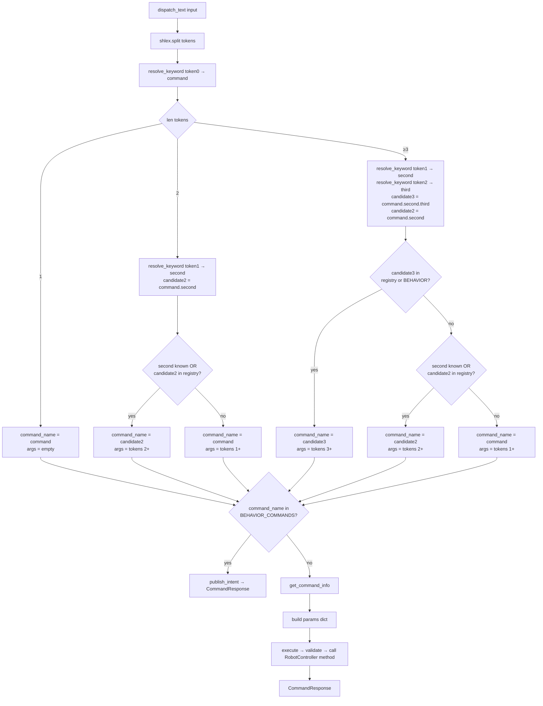

# CommandDispatcher: Command Registry and Execution

`CommandDispatcher` is the single entry point for all command execution. The CLI, REST API, and any future interface call `dispatcher.execute(name, params)` or `dispatcher.dispatch_text(text)` and get back a `CommandResponse`. The dispatcher handles parameter validation, type coercion, and method dispatch — callers never touch `RobotController` methods directly.

## Registry as a Dict

The command registry is a plain `dict[str, CommandDef]` built at construction time:

```python
def _build_command_registry(self) -> dict[str, cd.CommandDef]:
    commands = {}
    commands.update(mov_cmd.build_movement_commands())
    commands.update(ctrl_cmd.build_control_commands())
    commands.update(nav_cmd.build_navigation_commands())
    commands.update(lch_cmd.build_launch_commands())
    commands.update(sys_cmd.build_system_commands())
    commands.update(surv_cmd.build_survey_commands())
    for name, (description, group) in BEHAVIOR_COMMAND_DESCRIPTIONS.items():
        commands[name] = cd.CommandDef("", [], description, group)
    return commands
```

Each `build_*` function returns a dict of `"group.command" → CommandDef`. Behavior commands (intent and scene forms) are now registered here too — they appear in help output alongside direct commands, and the registry becomes the single source of truth for `get_command_info` lookups. The flat merge means duplicate names from different modules would silently shadow each other. Survey commands were added 2026-05-14 when `SpinSurvey` moved from `dome_vision` to `dome_control`.

## The Execute Path

```
dispatcher.execute("move.forward", {"meters": "1.5"})
    │
    ├── check BEHAVIOR_COMMANDS → not a behavior, continue
    ├── look up CommandDef in registry
    ├── _validate_parameters → coerce "1.5" → 1.5 (float)
    ├── getattr(robot_controller, "move_forward")
    └── method(meters=1.5) → CommandResponse
```

If the command name is in `BEHAVIOR_COMMANDS`, `execute` short-circuits: it calls `publish_intent` and returns without touching `RobotController`. This means a structured API call like `dispatcher.execute("intent.explore", {})` works the same as typing `intent explore` at the CLI.

## dispatch_text: Text-to-Command Routing

`dispatch_text(text)` is the entry point for free-form text input (CLI, voice transcripts). It tokenizes with `shlex.split` so quoted strings survive intact, then resolves abbreviations and determines the command name:

```python
def dispatch_text(self, text: str) -> rc.CommandResponse:
    try:
        tokens = shlex.split(text.strip())
    except ValueError:
        tokens = text.strip().split()
    ...
    intent_name = BEHAVIOR_COMMANDS.get(command_name)
    if intent_name is not None:
        reply = self.publish_intent(intent_name, slots)
        msg = reply if reply is not None else f"Intent published: {intent_name}"
        return rc.CommandResponse(True, msg)
    ...
    return self.execute(command_name, params)
```

Two routing paths:

- **Behavior path** — command name is in `BEHAVIOR_COMMANDS` → publish to `/intent` via `IntentPublisher`, return immediately.
- **Direct path** — everything else → look up `CommandDef`, validate params, call `RobotController` method.

## BEHAVIOR_COMMANDS

Maps CLI command names to intent names:

```python
BEHAVIOR_COMMANDS: dict[str, str] = {
    "intent.stop":           "stop",
    "intent.explore":        "explore",
    "intent.describe_scene": "describe_scene",
    "intent.count_objects":  "count_objects",
    "intent.list_objects":   "list_objects",
    "scene.describe":        "describe_scene",
    "scene.count":           "count_objects",
    "scene.objects":         "list_objects",
}
```

`scene.*` forms are preferred interactive vocabulary; `intent.*` forms are kept for scripting compatibility. `publish_intent` returns `str | None` — if `IntentApi` waited for a reply (query intents), the reply text comes back and replaces the default "Intent published" message in the `CommandResponse`.

## Abbreviation Resolution

`ABBREV_TO_FULL` and `FULL_NAMES` are module-level constants. `resolve_keyword` expands short tokens:

```python
ABBREV_TO_FULL = {"m": "move", "fwd": "forward", "stp": "stop", "sts": "status", ...}
FULL_NAMES = set(ABBREV_TO_FULL.values())

def resolve_keyword(word: str) -> str:
    if word in FULL_NAMES:
        return word
    return ABBREV_TO_FULL.get(word, word)
```

Unknown tokens pass through unchanged; errors surface at execution time. Note that `"stp"` expands to `"stop"` and `"sts"` to `"status"` — these are the expansions that make three-part commands like `nav explore stp` resolve correctly to `nav.explore.stop`.

## Subcommand Detection: 3-Token Candidate First

After resolving the first token, the parser now tries a **three-token candidate before falling back to two-token**. This is the key design decision that lets `nav explore stop` and `nav explore status` route to distinct leaf commands rather than both hitting `nav.explore`:

```python
second = resolve_keyword(tokens[1])
candidate2 = f"{command}.{second}"

# Try 3-token candidate first so "nav explore stop" hits nav.explore.stop
if len(tokens) >= 3:
    third = resolve_keyword(tokens[2])
    candidate3 = f"{command}.{second}.{third}"
    if candidate3 in self.commands or candidate3 in BEHAVIOR_COMMANDS:
        command_name = candidate3
        args = [parse_value(t) for t in tokens[3:]]
    else:
        in_registry2 = candidate2 in self.commands or candidate2 in BEHAVIOR_COMMANDS
        if second in FULL_NAMES or second != tokens[1] or in_registry2:
            command_name = candidate2
            args = [parse_value(t) for t in tokens[2:]]
        else:
            command_name = command
            args = [parse_value(t) for t in tokens[1:]]
else:
    in_registry2 = candidate2 in self.commands or candidate2 in BEHAVIOR_COMMANDS
    if second in FULL_NAMES or second != tokens[1] or in_registry2:
        command_name = candidate2
        args = [parse_value(t) for t in tokens[2:]]
    else:
        command_name = command
        args = [parse_value(t) for t in tokens[1:]]
```

The priority order is: **3-token match > 2-token match > 1-token match**. The 2-token fallback fires when the 3-token candidate is not found in either the command registry or `BEHAVIOR_COMMANDS` but the second token is recognizable (either a known full name, an abbreviation that was expanded, or a known compound command). If none of those conditions hold, the input is treated as a single-word command with all remaining tokens as positional arguments.

Why prioritize 3-token? The problem without it: `nav explore stop` would form `candidate2 = "nav.explore"`, find it in the registry, and pass `"stop"` as an argument to a command that doesn't expect one. With 3-token priority, `candidate3 = "nav.explore.stop"` is tested first; if that leaf exists it wins cleanly, and `tokens[3:]` (empty here) become the args.

## Dispatch Flow Diagram



## IntentPublisher Injection

```python
def __init__(self, robot_controller, intent_publisher=None):
    ...
    self.intent_publisher = intent_publisher
```

In production, leave `intent_publisher=None` — `publish_intent` creates an `IntentPublisher` lazily on first use. In tests, pass `IntentPublisher(publish_fn=published.append)` to capture published payloads without ROS2.

## Parameter Validation and Coercion

`_validate_parameters` iterates `CommandDef.parameters` in order, checking for required params and applying type coercion via `_convert_parameter_value`. Booleans need special handling because Python's `bool("false")` is `True`:

```python
if param_def.param_type == bool:
    if isinstance(value, str):
        return value.lower() in ("true", "1", "yes", "on")
    return bool(value)
```

For all other types, `param_def.param_type(value)` is called directly. If coercion fails, a descriptive `ValueError` naming the expected and received types is raised and caught by `execute`, which wraps it in a failed `CommandResponse`.

One additional convenience in `dispatch_text`: if the last declared parameter is `str` and there are more tokens than parameters, the overflow tokens are joined into a single string. This lets commands like `script run my long script name` work without requiring quotes.

## Observations

- **Silent shadowing.** Duplicate keys across `build_*` functions are silently overwritten. The last writer wins, with no warning at startup.
- **Method lookup at runtime.** A stale `method_name` in a `CommandDef` fails at call time, not at registry build time. Adding a smoke-test that calls `get_command_info` on every registered command and checks `hasattr(robot_controller, cmd.method_name)` would surface these early.
- **3-token depth is fixed.** The dispatch logic handles up to three-part command names (`a.b.c`). A fourth level would require another nested branch or a loop-based approach.
