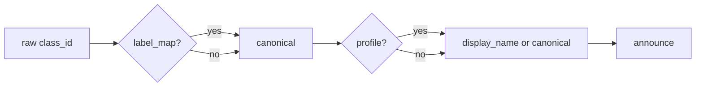

# PerceptionBehavior — Perception Intent Handler

## Purpose

`PerceptionBehavior` handles perception-domain intents routed from `BehaviorManagerNode`. It either calls a ROS2 service (`describe_scene`) or reads cached sensor data (`list_objects`) and publishes results to `/announcement`.

## Intent Routing

Three intents are handled:

```python
PERCEPTION_INTENTS = {"describe_scene", "count_objects", "list_objects"}
```

```python
    def execute(self, intent: Intent, node=None) -> None:
        if intent.name == "describe_scene":
            self.call_describe_scene()
        elif intent.name == "list_objects":
            self.report_detections()
        elif intent.name == "count_objects":
            self.node.get_logger().warn("count_objects intent not yet implemented")
```

## describe_scene: Unconditional Async Service Call

The `/describe_scene` service (provided by `describe_scene_stub` or a real vision node) returns a string description via `Trigger`. The call is async — the result arrives in `on_describe_scene_done`.

A key design choice: the node calls the service even if `service_is_ready()` returns `False`. A warning is logged, but the call proceeds. This avoids silent no-ops when the service is slow to register during startup:

```python
    def call_describe_scene(self) -> None:
        client = self.node.describe_scene_client
        if not client.service_is_ready():
            self.node.get_logger().warn("/describe_scene not ready — attempting call anyway")
        from std_srvs.srv import Trigger  # lazy — avoids rclpy at import time
        future = self.node.describe_scene_client.call_async(Trigger.Request())
        future.add_done_callback(self.on_describe_scene_done)
```

The tradeoff: if the service never comes up, the future never resolves and the callback is never called. That is acceptable — the system degrades silently rather than failing loudly.

The callback handles both failure modes — an exception (service timeout or crash) and a successful call that returns `success=False`:

```python
    def on_describe_scene_done(self, future) -> None:
        try:
            response = future.result()
        except Exception as exc:
            self.node.get_logger().error(f"/describe_scene call failed: {exc}")
            return

        if not response.success:
            self.node.get_logger().warn(
                f"/describe_scene returned failure: {response.message}"
            )
            return

        self.publish_announcement(response.message)
```

## list_objects: Reading Cached Detections with Label Resolution

`BehaviorManagerNode` caches the latest `Detection2DArray` from `/oak/detections`. `report_detections` reads that cache, picks the highest-scoring hypothesis per detection, and formats a sentence.

A significant feature is label resolution. Raw class IDs from the vision model (e.g. `"person_0"`) are mapped through two layers: `label_map` canonicalizes the raw ID, and `profiles` provides a human-readable `display_name`:

```python
    def report_detections(self) -> None:
        detections = getattr(self.node, "latest_detections", None)
        if detections is None or not detections.detections:
            self.publish_announcement("No objects detected.")
            return
        parts = []
        label_map = getattr(self.node, "label_map", {})
        profiles = getattr(self.node, "profiles", {})
        for det in detections.detections:
            if det.results:
                best = max(det.results, key=lambda r: r.hypothesis.score)
                raw_label = best.hypothesis.class_id
                canonical = label_map.get(raw_label, raw_label)
                profile = profiles.get(canonical)
                label = (profile.display_name or canonical) if profile else canonical
                score = round(best.hypothesis.score, 2)
                parts.append(f"{label} {score}")
        text = "I see: " + ", ".join(parts) if parts else "No objects detected."
        self.publish_announcement(text)
```

The fallback chain is: `display_name` → canonical label → raw class ID. If `dome_vision` never loaded (profiles dict is empty), the raw class ID is used as-is.



## Observations

- `getattr(self.node, "latest_detections", None)` and `getattr(self.node, "label_map", {})` are defensive — both work whether oak and dome_vision are running or not.
- `count_objects` is registered but unimplemented. Should be removed or implemented.
- The lazy `from std_srvs.srv import Trigger` import avoids pulling rclpy at module load, keeping the class testable without ROS.
- Calling unconditionally when `service_is_ready()` is False is a deliberate bet against transient startup delays. If the service is genuinely absent the future silently stalls — no user-visible error. A timeout mechanism would improve this.
